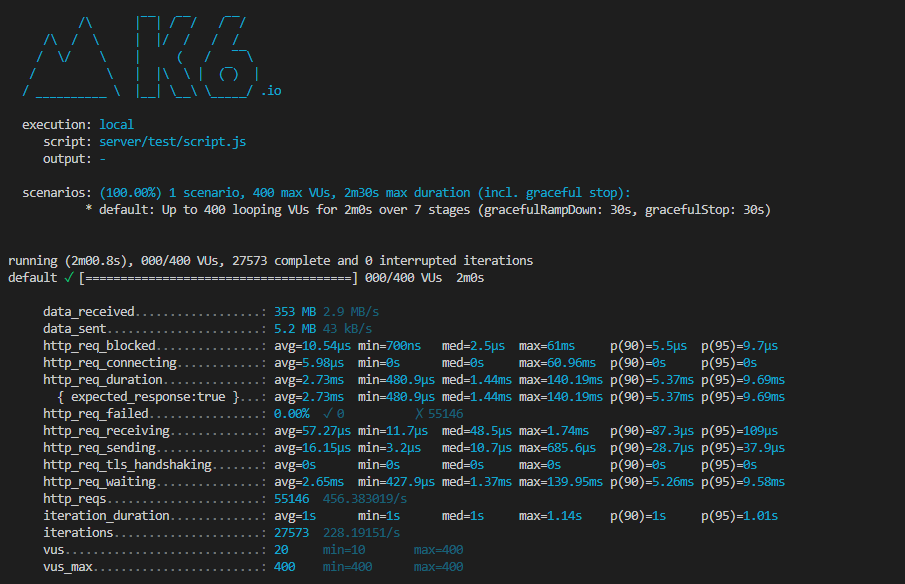
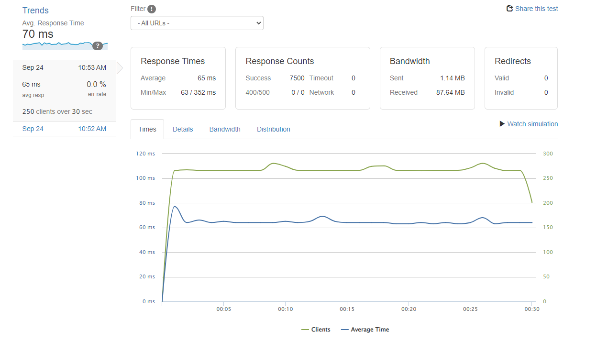
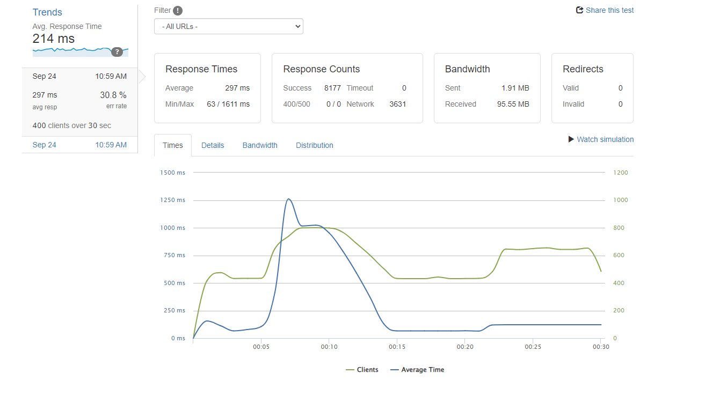
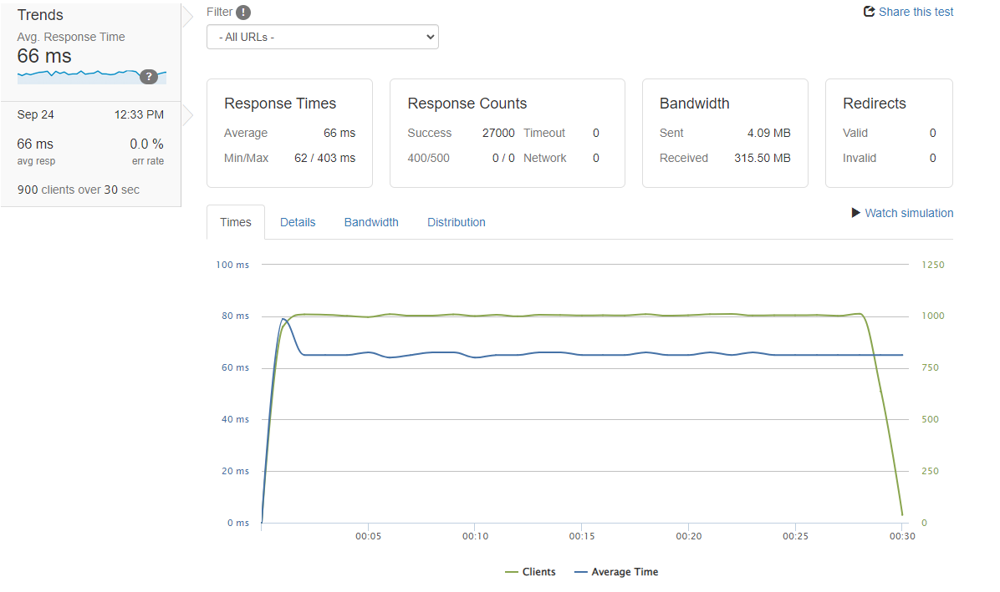

# Atelier Ecommerce Backend Microservice

Atelier is a backend microservice for an E-Commerce website which was scaled in AWS EC2 using an Nginx Load Balancing Server, 4 host servers and PostgreSQL database. It supports 1K RPS with response latency of 65ms (down from 500ms+).

## Details

### Step 1: API Endpoints and Local testing
After creating all the API endpoints and routes, local benchmarks for each endpoint averaged around 800ms. After indexing, query speeds increased from 3 seconds to 50ms (using PgAdmin) and 10ms (using Postman). Local stress test with K6 shows that the breakpoint was at 500RPS.

### Query Results

| Indexing | Time          |
| :---     | :----:        |
| Without  | 3.131 seconds |
| With/PgAdmin     | 0.045 seconds |
| With/Postman     | 0.010 seconds |

### Stress Test

## Step 2: Deployment and Cloud Based Testing

Initially deployed a single instance on AWS, I found that server location greatly affected RPS and response latency. This server, based in N.Virginia (US East), had an average reponse time of 500ms. In order to improve speeds, I created a copy of the server with AWS AMI and deployed across region to N.California (US West). This improved response latency from 500ms to 60ms. Tests via LoaderIO showed breakpoint at 400 RPS with average speeds of 65ms.

### Results

| Server Location | Time          |
| :---     | :----:        |
| US East     | 0.500 seconds |
| US West     | 0.065 seconds |

### Stress Test

## Step 3: Scaling

Implemented horizontal scaling solution with Nginx Load Balancer as a standalone server along with 4 host servers. This was able to bring my total RPS to 1k with a response time of 65ms. 

## Results:

